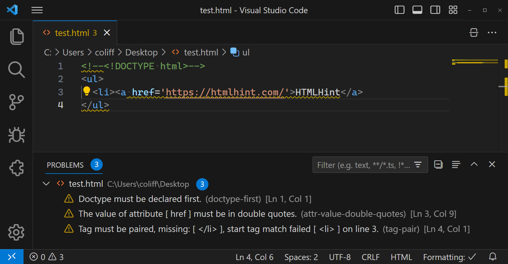

import { LinkCard, CardGrid } from '@astrojs/starlight/components'

Get realtime linting feedback in Visual Studio Code with the HTMLHint extension. This extension provides a seamless integration of HTMLHint into your development workflow, allowing you to catch HTML issues as you type.

The HTMLHint extension will attempt to use the locally installed HTMLHint module (the project-specific module if present, or a globally installed HTMLHint module). If a locally installed HTMLHint isn't available, the extension will use the embedded version (current version 1.1.4).

## Download

<CardGrid>
  <LinkCard
    title="VS Code Marketplace"
    href="https://marketplace.visualstudio.com/items?itemName=HTMLHint.vscode-htmlhint"
  />
  <LinkCard
    title="Open VSX Registry"
    href="https://open-vsx.org/extension/HTMLHint/vscode-htmlhint"
  />
</CardGrid>
